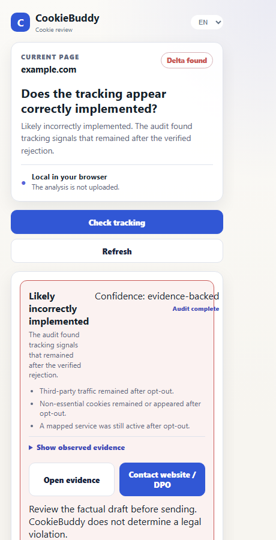
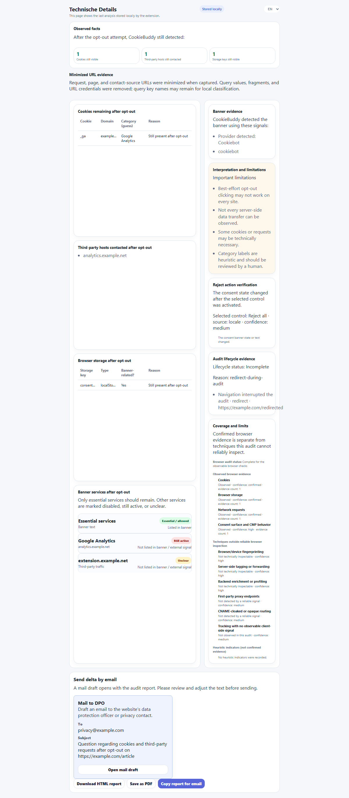

# CookieBuddy

CookieBuddy is a local Chrome extension for reviewing cookie-consent and tracking behavior on websites.

The product direction is a one-click technical audit that answers a simple question first: **does optional tracking appear to stop correctly after rejection?** CookieBuddy should then show the evidence behind that answer and, when a supported problem is found, make a factual complaint or escalation easy to prepare.

CookieBuddy provides technical review signals, not legal advice or a legal compliance verdict.

## Product Principle

The intended product flow is:

1. Start one audit.
2. Observe the current consent/tracking state.
3. Reject optional consent using a verified action where possible.
4. Reload and observe the post-rejection state.
5. Compare consent signals, cookies, browser storage, and network traffic.
6. Produce a conservative verdict with confidence and coverage.
7. Show reproducible evidence.
8. Offer a factual complaint/escalation draft when supported by the evidence.

A positive/green result is only valid when all mandatory checks completed successfully and no contradictory evidence was observed. Unknown, unsupported, contaminated, or incomplete coverage must remain unclear/incomplete rather than becoming green.

## Current Capabilities

The current implementation already provides a local browser-side summary of:

- detected consent-banner/CMP evidence
- visible cookies and browser storage
- observed third-party requests while the tab is open
- service/category hints
- privacy/DPO contact discovery
- a best-effort before/after rejection check
- local HTML/printable report export
- German and English UI

The acceptance contract below also defines the target behavior for the next implementation tasks. A scenario may therefore describe required behavior that is not fully implemented yet; the corresponding GitHub issue is the implementation task.

## Acceptance Contract

The source of truth for product acceptance behavior is [`features/cookiebuddy.feature`](features/cookiebuddy.feature). Every scenario has a stable `@UC-xx` ID. Product changes must update the affected Gherkin scenario, real automated tests, this README, and—when visible behavior changes—visual tests and screenshots in the same change.

| ID | Contract |
| --- | --- |
| UC-01 | Scan the visited page locally and show observed consent, cookie, storage, and network evidence. |
| UC-02 | Prefer a DPO contact found in the visited site's privacy policy over a generic contact. |
| UC-03 | Fall back to a clearly labeled DPO contact in the site's imprint when appropriate. |
| UC-04 | Run a controlled before/after rejection audit with explicit observation windows and reload. |
| UC-05 | Verify that reject-all actually changed consent; a successful DOM click alone is insufficient, and the report records the selected control plus verification evidence. |
| UC-06 | Detect supported CMP APIs in the page main world and inspect IAB TCF / Google Consent Mode where available. |
| UC-07 | Flag consent signals that contradict the rejected UI state as high-confidence technical findings. |
| UC-08 | Preserve concurrent network evidence without request-loss race conditions. |
| UC-09 | Capture relevant first-party and observable third-party cookie metadata without dumping unrelated cookies or values. |
| UC-10 | Include supported localStorage, sessionStorage, IndexedDB, Cache Storage, and service-worker metadata. |
| UC-11 | Classify endpoint relationships with Public Suffix List compatible registrable-domain logic. |
| UC-12 | Classify necessity conservatively with rationale and confidence; names/CDNs alone cannot prove necessity. |
| UC-13 | Recognize services from versioned maintainable offline rule data while keeping unknown signals visible. |
| UC-14 | Detect consent surfaces in the top document, supported frames, and open shadow roots; inaccessible surfaces remain explicit. |
| UC-15 | Detect contaminated audit state such as prior consent, blockers, tracking protection, or other conditions that undermine integrity. |
| UC-16 | Handle SPA navigation, redirects, popup closure, service-worker restart, reload, tab closure, and delayed trackers deterministically; persist lifecycle evidence and never render interrupted work as green. |
| UC-17 | Produce a conservative verdict: looks correct, review recommended, likely incorrect, or audit incomplete. |
| UC-18 | Build an evidence-grade report with timeline, coverage, observed facts, interpretation, and machine-readable export. |
| UC-19 | Minimize sensitive URL data at capture time; exclude query values and fragments by default. |
| UC-20 | Optionally capture user-controlled visual evidence with preview/removal before export. Screenshots are off by default, limited to the tested active tab, linked to audit steps, and recorded as unavailable when browser permissions prevent capture. |
| UC-21 | Prepare a factual complaint/escalation draft using only evidence actually present in the audit. |
| UC-22 | Present the one-click verdict and audit completeness before technical metrics, with one to three plain-language reasons and progressive evidence. |
| UC-23 | Support multilingual/accessibility-aware consent controls safely without broad-text false clicks. Consent vocabulary is local, explicit, and extended through locale data; accessible names and roles are used for icon-only controls, while unsupported language stays unresolved. |
| UC-24 | Explain limits for fingerprinting, server-side tagging, backend enrichment, first-party proxies, and other opaque techniques. |
| UC-25 | Keep CookieBuddy itself private and performant: justified permissions, local processing, deletion, bounded retention and overhead. |
| UC-26 | Keep Gherkin, implementation tests, README, visual tests, and screenshots synchronized for every affected product task. |

`tests/use-cases.test.mjs` checks that every Gherkin use-case ID is represented in this README and that key safety invariants remain present. This is only contract hygiene: each implemented scenario also requires functional/unit/integration coverage of the real behavior.

## How To Use the Current Prototype

1. Open Chrome.
2. Go to `chrome://extensions`.
3. Enable Developer mode.
4. Click `Load unpacked`.
5. Select this repository folder.
6. Open a website and click the CookieBuddy extension icon.
7. Use `Seite neu erfassen / Refresh` to capture the current page locally.
8. Select `Tracking prüfen / Check tracking` to run the guided audit and review the top-level verdict.

The target UX replaces the technical `Delta-Check` framing with a plain-language one-click tracking audit and top-level verdict (UC-22).

## Product Screenshots

The screenshots below are generated from the same Playwright fixture used by the visual test suite. They document the current primary product states without uploading real browsing data.

| Scan overview | Delta audit and export |
| --- | --- |
|  |  |

To regenerate them after a visible UI change:

```sh
$env:COOKIEBUDDY_SCREENSHOT_DIR = "docs/screenshots"
npm run test:visual
```

A visible flow change is not complete until the matching Gherkin scenario, functional tests, visual tests, README description/use-case contract, and screenshots are updated together.

## Verdict Model

The target verdict model is deliberately conservative:

- **Looks correctly implemented** — all mandatory checks completed and no contradictory evidence was observed.
- **Review recommended** — relevant signals remain ambiguous or unknown.
- **Likely incorrect implementation** — strong contradictory technical evidence remains after rejection.
- **Audit incomplete / unable to determine** — a mandatory check failed, was unsupported, or audit integrity was insufficient.

These are technical review outcomes, not legal conclusions.

## Evidence Model

CookieBuddy should separate raw observation from interpretation.

Observed evidence may include:

- audit step and timestamp
- tested URL/host (minimized before persistence)
- CMP/banner evidence
- reject action and verification evidence
- consent framework state before/after
- cookie metadata without cookie values
- supported browser-storage metadata
- request host/path/type/timestamp with sensitive URL values removed by default
- optional before/after screenshots of the tested tab, with minimized URL metadata and explicit local review/removal
- service/rule mapping and confidence
- explicit unsupported or incomplete checks

Interpretations must link back to the evidence that produced them.

## Privacy

CookieBuddy is designed to stay local.

- No analytics
- No telemetry
- No remote logging
- No account system
- No user identifiers
- No automatic scan upload
- No cookie values stored/exported by default
- Sensitive URL query/fragment values should be removed before evidence is persisted
- Optional screenshots remain local, are off by default, and may contain page content or personal information; review and remove them before export.

CookieBuddy may inspect the page, cookies, supported browser storage, consent APIs, and browser requests only to perform the user's local audit. Local audit data must have documented retention/deletion behavior.

## Performance budgets

The budgets are local safeguards, not telemetry:

- Idle browsing captures zero requests and performs zero per-request session-storage writes.
- An active audit runs for at most 30 seconds and retains at most 500 requests per tab.
- Page analysis limits text to 120,000 characters, HTML evidence to 250,000 characters, resources to 250 entries, stored entries to 50, contact pages to 8, and each contact response to 200,000 characters with a 1.5-second timeout.
- Each page analysis records only local duration and bounded sample counts for regression inspection; it does not upload performance data.

The corresponding contract and regression tests live in `tests/performance-budget.test.mjs`. If a limit is exceeded, the audit remains local and is marked incomplete rather than silently weakening evidence integrity.

## Audit lifecycle

During an audit, CookieBuddy keeps a minimal state machine in local session storage. SPA route changes, redirects, reloads, tab switches, popup reopening, service-worker restarts, tab closure, and observation timeouts are recorded as lifecycle evidence. A navigation that changes the page baseline, a popup/service-worker interruption, or a timeout ends the run as incomplete; a closed tested tab ends it as failed. The next popup can inspect that state and start a fresh audit explicitly. Lifecycle URLs are stored without query parameters or fragments.

## Detection Limits

CookieBuddy can only assess evidence observable from the browser extension context. It must not imply complete tracking detection.

Important limitations include:

- server-side tagging or forwarding that produces no distinguishable browser-side destination
- backend enrichment or profiling
- opaque first-party proxy endpoints
- some CNAME-cloaked or first-party-looking tracking
- fingerprinting that leaves no reliable identifiable client-side signal
- inaccessible cross-origin consent UI or browser APIs
- interference from blockers, browser tracking protection, prior consent, login state, or other contaminated browser state

Reports and verdicts must distinguish **not observed** (no signal appeared in this audit), **not detected** (CookieBuddy has no reliable detector for the technique), and **not technically inspectable** (the technique can run outside observable browser evidence). Confirmed cookies, browser storage, network requests, and consent-surface evidence are listed separately from low-confidence heuristic indicators. These states describe the audit's evidence scope; they never claim complete tracking detection.

## Development Contract

For every task that changes product behavior, detection, classification, verdicts, evidence, privacy behavior, user flow, or visible UI:

1. Identify the affected `@UC-xx` scenario(s).
2. Update/add the Gherkin scenario in the same change.
3. Add/update real automated tests for the acceptance behavior, including negative/failure paths.
4. Update this README use-case contract and relevant product/limitations/privacy text.
5. Update visual tests and regenerate screenshots when visible behavior changes.
6. Do not mark the task complete while any affected artifact is stale.

See [`agent.md`](agent.md) for the full implementation rules.

## Development Checks

CookieBuddy has no production build step. Development checks use the packages in `package.json`.

For product changes run:

```sh
npm test
npm run check
npm run test:visual
```

For documentation/contract-only changes at minimum run:

```sh
node --test tests/use-cases.test.mjs
```

GitHub Actions should run the automated checks on pushes and pull requests. A feature-specific task is complete only when the actual behavioral tests for its acceptance criteria exist and pass; the Gherkin/README sync test alone is not sufficient.

## Project Structure

- `features/cookiebuddy.feature`: authoritative Gherkin acceptance contract
- `manifest.json`: Chrome extension configuration
- `popup.html`: main popup
- `details.html`: audit details and evidence actions
- `src/background.js`: request capture and extension status
- `src/content.js`: page/CMP analysis and consent actions
- `src/popup.js`: popup and audit orchestration
- `src/core.js`: shared classification/delta helpers
- `src/details.js`: details view and report export
- `src/i18n.js`: English/German text handling
- `tests/use-cases.test.mjs`: contract/README synchronization guard
- `tests/`: functional, integration, unit, and visual tests

## Links

- Repository: https://github.com/Ben1991/CookieBuddy
- Donate: https://buymeacoffee.com/thenext1991
